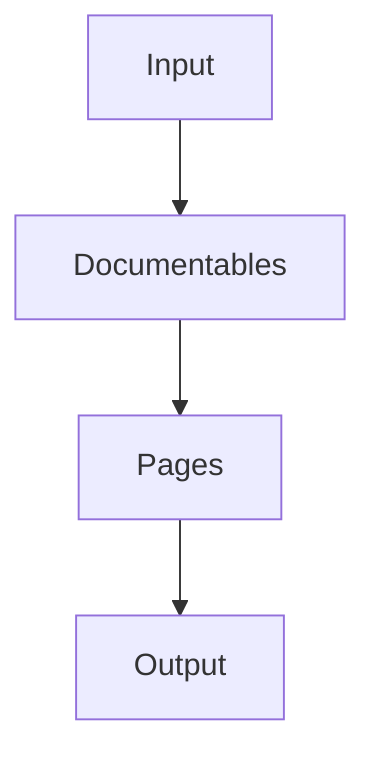

# Architecture overview

Normally, you would think that a tool like Dokka simply parses some programming language sources and generates
HTML pages for whatever it sees along the way, with little to no abstractions. That would be the simplest and
the most straightforward way to implement an API documentation engine.

However, it was clear that Dokka may need to generate documentation from various sources (not only Kotlin), that users
might request additional output formats (like Markdown), that users might need additional features like supporting
custom KDoc tags or rendering [mermaid.js](https://mermaid.js.org/) diagrams - all these things would require changing 
a lot of code inside Dokka itself if all solutions were hardcoded.

For this reason, Dokka was built from the ground up to be easily extensible and customizable by adding several layers
of abstractions to the data model, and by providing pluggable extension points, giving you the ability to introduce
selective changes on a given level.

## Overview of data model

Generating API documentation begins with input source files (`.kt`, `.java`, etc) and ends with some output files
(`.html`/`.md`, etc). However, to allow for extensibility and customization, several input and output independent
abstractions have been added to the data model.

Below you can find the general pipeline of processing data gathered from sources and the explanation for each stage.



* `Input` - generalization of sources, by default Kotlin / Java sources, but could be virtually anything
* [`Documentables`](data_model/documentable_model.md) - unified data model that represents _any_ parsed sources as a 
  tree, independent of the source language. Examples of a `Documentable`: class, function, package, property, etc
* [`Pages`](data_model/page_content.md) - universal model that represents output pages (e.g a function/property page) 
  and the content it's composed of (lists, text, code blocks) that the users needs to see. Not to be confused with 
  `.html` pages. Goes hand in hand with the so-called [Content model](data_model/page_content.md#content-model).
* `Output` - specific output formats like HTML / Markdown / Javadoc and so on. This is a mapping of the pages/content 
  model to a human-readable and visual representation. For instance:
    * `PageNode` is mapped as 
        * `.html` file for the HTML format
        * `.md` file for the Markdown format
    * `ContentList` is mapped as
        * `<li>` / `<ul>` for the HTML format
        * `1.` / `*` for the Markdown format
    * `ContentCodeBlock` is mapped as
        * `<code>` or `<pre>` with some CSS styles in the HTML format
        * Text wrapped in triple backticks for the Markdown format

    
You, as a Dokka developer or a plugin writer, can use extension points to introduce selective changes to the
model on one particular level without altering everything else. 

For instance, if you wanted to make an annotation / function / class invisible in the final documentation, you would only
need to modify the `Documentables` level by filtering undesirable declarations out. If you wanted to display all overloaded
methods on the same page instead of on separate ones, you would only need to modify the `Pages` layer by merging multiple
pages into one, and so on.

For a deeper dive into Dokka's model with more examples and details,
see sections about [Documentables](data_model/documentable_model.md) and [Page/Content](data_model/page_content.md)

For an overview of existing extension points that let you transform Dokka's models, see 
[Core extension points](extension_points/core_extension_points.md) and [Base extensions](extension_points/base_plugin.md).

## Overview of extension points

An _extension point_ usually represents a pluggable interface that performs an action during one of the stages of
generating documentation. An _extension_ is, therefore, an implementation of the interface which is extending the
extension point.

You can create extension points, provide your own implementations (extensions) and configure them. All of
this is possible with Dokka's plugin / extension point API.

Here's a sneak peek of the DSL:

```kotlin
// declare your own plugin
class MyPlugin : DokkaPlugin() {
    // create an extension point for developers to use
    val signatureProvider by extensionPoint<SignatureProvider>()

    // provide a default implementation
    val defaultSignatureProvider by extending {
        signatureProvider with KotlinSignatureProvider()
    }

    // register our own extension in Dokka's Base plugin by overriding its default implementation
    val dokkaBasePlugin by lazy { plugin<DokkaBase>() }
    val multimoduleLocationProvider by extending {
        (dokkaBasePlugin.locationProviderFactory
                providing MultimoduleLocationProvider::Factory
                override dokkaBasePlugin.locationProvider)
    }
}

class MyExtension(val context: DokkaContext) {

    // use an existing extension
    val signatureProvider: SignatureProvider = context.plugin<MyPlugin>().querySingle { signatureProvider }

    fun doSomething() {
        signatureProvider.signature(..)
    }
}

interface SignatureProvider {
    fun signature(documentable: Documentable): List<ContentNode>
}

class KotlinSignatureProvider : SignatureProvider {
    override fun signature(documentable: Documentable): List<ContentNode> = listOf()
}
```

For a deeper dive into extensions and extension points, see [Introduction to Extensions](extension_points/extension_points.md).

For an overview of existing extension points, see [Core extension points](extension_points/core_extension_points.md) and
[Base extensions](extension_points/base_plugin.md).

## Historical context

This is a second iteration of Dokka that was built from scratch.

If you want to learn more about why Dokka was redesigned this way, watch this great talk by Paweł Marks:
[New Dokka - Designed for Fearless Creativity](https://www.youtube.com/watch?v=OvFoTRhqaKg). The general principles 
and general architecture are the same, although it may be outdated in some areas, so please double-check.
