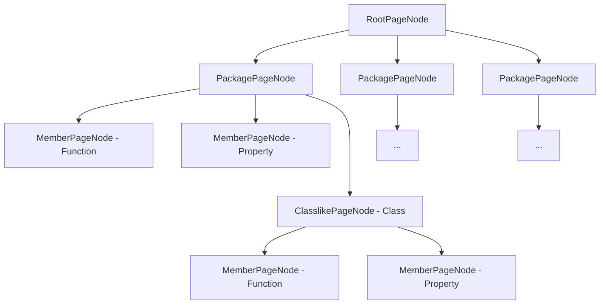

# Page / Content Model

Even though the `Page` and `Content` models reside on the same level (under `Page`), it is easier to view them as two 
different models altogether, even though `Content` is only used in conjunction with and inside the `Page` model only.

## Page

The Page model represents the structure of documentation pages to be generated. During rendering, each page
is processed separately, so one page corresponds to exactly one output file.

The Page model is independent of the final output format. In other words, it's universal. Which file extension the pages
should be created as (`.html`, `.md`, etc), and how, is up to the 
[Renderer](../extension_points/core_extension_points.md#renderer) extension.

Subclasses of the `PageNode` class represent the different kinds of pages, such as `ModulePage`, `PackagePage`,
`ClasslikePage`, `MemberPage` and so on.

The Page model can be represented as a tree, with `RootPageNode` at the root.

Here's an example of how an arbitrary project's `Page` tree might look like, if the project consists of a module with 
3 packages, one of which contains a top level function, a top level property and a class, inside which there's a function
and a property:



Almost all pages are derivatives of `ContentPage` - it's the type of a page that has user-visible content on it.

## Content Model

The Content model describes what the pages consist of. It is essentially a set of building blocks that you can put 
together to represent some content. It is also output-format independent and universal.

For an example, have a look at the subclasses of `ContentNode`: `ContentText`, `ContentList`, `ContentTable`, 
`ContentCodeBlock`, `ContentHeader` and so on -- all self-explanatory. You can group chunks of content together with 
`ContentGroup` - for example, to wrap all children with a style.

```kotlin
// real example of composing content using the `DocumentableContentBuilder` DSL
orderedList {
    item {
        text("This list contains a nested table:")
        table {
            header {
                text("Col1")
                text("Col2")
            }
            row {
                text("Text1")
                text("Text2")
            }
        }
    }
    item {
        group(styles = setOf(TextStyle.Bold)) {
            text("This is bald")
            text("This is also bald")
        }
    }
}
```

It is the responsibility of the `Renderer` (i.e a specific output format) to render it in a way the user can process it,
be it visually (html pages) or otherwise (json).

For instance, `HtmlRenderer` might render `ContentCodeBlock` as `<code>text</code>`, but `CommonmarkRenderer` might 
render it using backticks.

### DCI

Each node is identified by a unique `DCI`, which stands for _Dokka Content Identifier_. 

`DCI` aggregates `DRI`s of all documentables that are used by the given `ContentNode`.

```kotlin
data class DCI(val dri: Set<DRI>, val kind: Kind)
```

All references to other nodes (other than direct ownership) are described using `DCI`.

### ContentKind

`ContentKind` represents a grouping of content of one kind that can be rendered as part of a composite
page, like a single one tab or a block within a class's page.

For example, on the same page that describes a class you can have multiple sections (== `ContentKind`s).
One to describe functions, one to describe properties, another one to describe the constructors, and so on.

### Styles

Each `ContentNode` has a `styles` property in case you want to indicate to the `Renderer` that this content needs to be
rendered in a certain way.

```kotlin
group(styles = setOf(TextStyle.Paragraph)) {
    text("Text1", styles = setOf(TextStyle.Bold))
    text("Text2", styles = setOf(TextStyle.Italic))
}
```

It is responsibility of the `Renderer` (i.e a specific output format) to render it in a way the user can process it. 
For instance, `HtmlRenderer` might render `TextStyle.Bold` as `<b>text</b>`, but `CommonmarkRenderer` might render it 
as `**text**`.

There's a number of existing styles that you can use, most of them are supported by the `HtmlRenderer` extension out of 
the box:

```kotlin
// for code highlighting
enum class TokenStyle : Style {
    Keyword, Punctuation, Function, Operator, Annotation,
    Number, String, Boolean, Constant, Builtin, ...
}

enum class TextStyle : Style {
    Bold, Italic, Strong, Strikethrough, Paragraph, ...
}

enum class ContentStyle : Style {
    TabbedContent, RunnableSample, Wrapped, Indented, ...
}
```

### Extra

`ExtraProperty` is used to store any additional information that falls outside of the regular model. 

It is highly recommended to use extras to provide any additional information when creating custom Dokka plugins.

All `ExtraProperty` elements from the `Documentable` model are propagated into the `Content` model, and are available
in the `Renderer` extensions.

This element is a bit complex, so you can read more about how to use it [in a separate section](extra.md).
