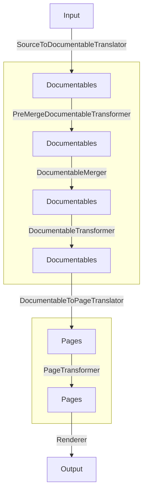

# Generation implementations

There are two main implementations of the [Generation](core_extension_points.md#generation) core extension point:

* `SingleModuleGeneration` - generates documentation for a single module, for instance when `dokkaHtml` task is invoked
* `AllModulesPageGeneration` - generates multi-module documentation, for instance when `dokkaHtmlMultiModule` task is
  invoked.

## SingleModuleGeneration

`SingleModuleGeneration` is at the heart of generating documentation. It utilizes [core](core_extension_points.md) and 
[base](base_plugin.md) extensions to build the documentation from start to finish.

Below you can see the flow of how Dokka's [data model](../architecture_overview.md#overview-of-data-model) is transformed
by various core and base extensions.

You can read about what each stage does in [Core extension points](core_extension_points.md) and 
[Base plugin](base_plugin.md).

## AllModulesPageGeneration

`AllModulesPageGeneration` utilizes the output generated by `SingleModuleGeneration`. 

Under the hood, it just collects all of the pages generated for individual modules, and assembles it all together, 
creating navigation links between the modules and so on.
