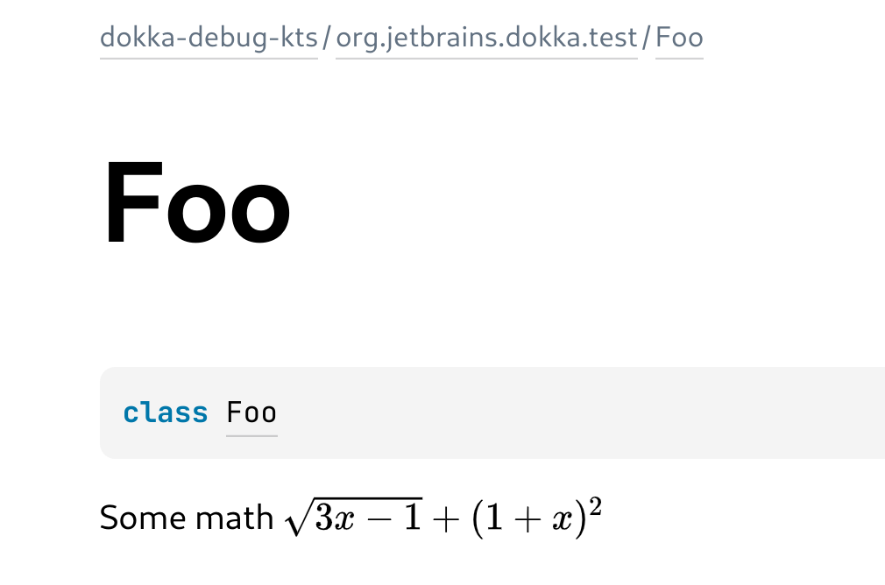
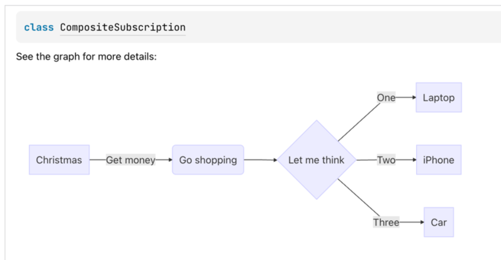

# Dokka community plugins

On this page you can find `Dokka` plugins which are supported by both `Dokka` maintainers and community members.

If you want to add your plugin to this list, get in touch with maintainers via [Slack](../community/slack.md)
or `GitHub`.

If you want to learn how to develop plugins for `Dokka`, see 
[Plugin development](../developer_guide/plugin-development/introduction.md) section.

## Output Formats

### Javadoc (Alpha)

Javadoc plugin adds a `Javadoc` output format that looks like Java's `Javadoc`, but it's for the most part
a lookalike, so you may experience problems if you try to use it with a tool that expects native
`Javadoc` documentation generated by `Java`.

`Javadoc` plugin does not support multiplatform projects and does not have a multi-module task.

`Javadoc` plugin is shipped with `Dokka`, so you can start using it right away with one of the following tasks:

* `dokkaJavadoc` - builds `Javadoc` documentation for single-module projects or for a specific module.
* `dokkaJavadocCollector` - collects generated `Javadoc` documentation from submodules and assembles it together.

`Javadoc` plugin has its own signature provider that essentially translates `Kotlin` signatures to `Java` ones.

**This plugin is at its early stages**, so you may experience issues and encounter bugs. Feel free to
[report](https://github.com/Kotlin/dokka/issues/new/choose) any errors you see.

[Plugin source code on GitHub](https://github.com/Kotlin/dokka/tree/master/plugins/javadoc)

### GFM (Alpha)

`GFM` plugins adds the ability to generate documentation in `GitHub flavoured Markdown` format. Supports both
multimodule and multiplatform projects, and is shipped together with `Dokka`, so you can start using it
right away with one of the following tasks:

* `dokkaGfm` - generate documentation for a non multi-module project or one specific module.
* `dokkaGfmMultiModule` - generate documentation for a multi-module project, assemble it together and
  generate navigation page/menu for all the modules.

Example:

___

//[dokka-debug-kts](#gfm)/[org.jetbrains.dokka.test](#gfm)/[MyClass](#gfm)

#### MyClass

[jvm]
class [MyClass](#gfm)

KDoc that describes this class

##### Constructors

| | |
|---|---|
| [MyClass](#gfm) | [jvm]<br>fun [MyClass](#gfm)() |

##### Functions

| Name             | Summary |
|------------------|---|
| [function](#gfm) | [jvm]<br>fun [function](#gfm)(): [String](https://kotlinlang.org/api/latest/jvm/stdlib/kotlin/-string/index.html)<br>KDoc comment on top of this function |

##### Properties

| Name | Summary                                                                                                                                        |
|---|------------------------------------------------------------------------------------------------------------------------------------------------|
| [property](#gfm) | [jvm]<br>val [property](#gfm): [String](https://kotlinlang.org/api/latest/jvm/stdlib/kotlin/-string/index.html)<br>KDoc comment for a property |

___

**This plugin is at its early stages**, so you may experience issues and encounter bugs. Feel free to 
[report](https://github.com/Kotlin/dokka/issues/new/choose) any errors you see.

[Plugin source code on GitHub](https://github.com/Kotlin/dokka/tree/master/plugins/gfm)

### Jekyll (Alpha)

`Jekyll` plugins adds the ability to generate documentation in `Jekyll flavoured Markdown` format. Supports both
multi-module and multiplatform projects, and is shipped together with `Dokka`, so you can start using it
right away with one of the following tasks:

* `dokkaJekyll` - generate documentation for a non multi-module project or one specific module.
* `dokkaJekyllMultiModule` - generate documentation for a multi-module project, assemble it together and
  generate navigation page/menu for all the modules.

**This plugin is at its early stages**, so you may experience issues and encounter bugs. Feel free to
[report](https://github.com/Kotlin/dokka/issues/new/choose) any errors you see.

[Plugin source code on GitHub](https://github.com/Kotlin/dokka/tree/master/plugins/jekyll)

## Extensions

### Mathjax

[MathJax](https://docs.mathjax.org/) allows you to include mathematics in your web pages. `MathJax` plugin
adds the ability to render mathematics from source code comments.

If `MathJax` plugin encounters `@usesMathJax` `KDoc` tag, it adds `MathJax.js` (ver. 2) with `config=TeX-AMS_SVG`
to generated `HTML` pages.

Usage example:
```kotlin
/**
 * Some math \(\sqrt{3x-1}+(1+x)^2\)
 * 
 * @usesMathJax
 */
class Foo {}
```

Which results in:

{ width="400" }

[Plugin source code on GitHub](https://github.com/Kotlin/dokka/tree/master/plugins/mathjax)

### Mermaid

[Mermaid JS](https://mermaid-js.github.io/mermaid/#/) lets you create diagrams and visualizations using text and code. 
`Mermaid` plugin allows rendering such diagrams and visualizations found in source code documentation.

Usage example:
```kotlin
/**
 * See the graph for more details:
 * \```mermaid
 * graph LR
 *   A[Christmas] -->|Get money| B(Go shopping)
 *   B --> C{Let me think}
 *   C -->|One| D[Laptop]
 *   C -->|Two| E[iPhone]
 *   C -->|Three| F[fa:fa-car Car]
 * \```
 */
class CompositeSubscription
```

Which results in:

{ width="700" }

For more information and examples, see 
[Html Mermaid Dokka plugin](https://github.com/glureau/dokka-mermaid) repository on GitHub.

### Kotlin as Java

With `Kotlin as Java` plugin applied, all `Kotlin` signatures will be rendered as `Java` signatures. 

For instance, `fun foo(bar: Bar): Baz` will be rendered as `public final Baz foo(Bar bar)`.

`Kotlin as Java` plugin is published to maven central as a 
[separate artifact](https://mvnrepository.com/artifact/org.jetbrains.dokka/kotlin-as-java-plugin): 
`org.jetbrains.dokka:kotlin-as-java-plugin:1.7.20`. 

[Plugin source code on GitHub](https://github.com/Kotlin/dokka/tree/master/plugins/kotlin-as-java)
