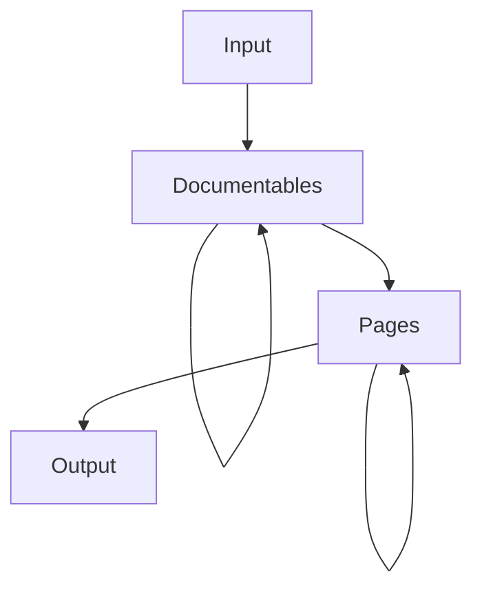
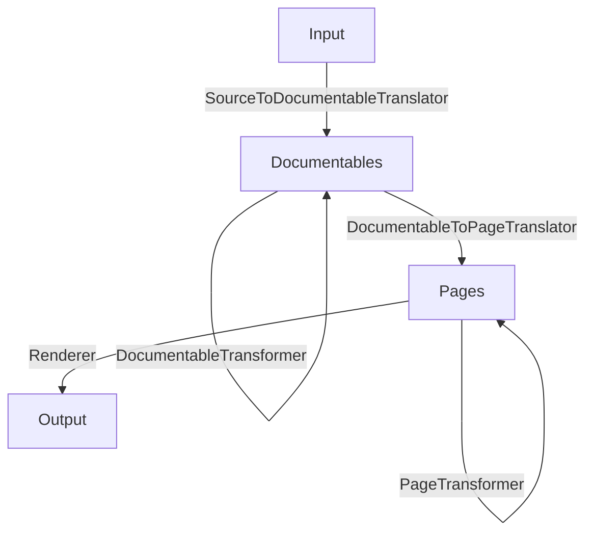

# Architecture overview

Normally, you would think that a tool like Dokka simply parses some programming language sources and generates
`HTML` pages for whatever it sees along the way, with little to no abstractions. That would be the simplest and
shortest way to implement a documentation engine.

However, it was clear Dokka may need to generate documentation from various sources (not only `Kotlin`), that users
might request additional output formats (like `Markdown`), that users might need additional features like supporting
custom KDoc tags or rendering `mermaid.js` diagrams from documentation in the source code - all these things would
require changing a lot of code inside Dokka itself if all solutions were hardcoded.

For this reason, Dokka was built from the ground up to be extensible and customizable. You can think of the general
flow of generating documentation with Dokka as mapping one intermediate representation / abstraction into another.
Then you, as a Dokka developer or a plugin writer, can use extension points and introduce selective changes to the
model on any level without touching everything else.

## Overview of data model

* `Input` - generalization of sources, by default `Kotlin`/`Java` sources, but could be virtually anything
* `Documentables` - unified data model that represents any parsed sources as a tree. 
  Examples: class/function/package/property
* `Pages` - universal model that represents pages (e.g a function/property page) and its content
  (lists, text, code blocks) that the users needs to see
* `Output` - specific output format like `HTML`/`Markdown`/`Javadoc`/etc. This is a mapping of content to
  some human-readable and visual representation. For instance:
  * `ContentList` is mapped as
    * `<li>` / `<ul>` for `HTML` format
    * `1.` / `*` for `Markdown` format
  * `ContentCodeBlock` is mapped as
    * `<code>` or `<pre>` with some CSS styles in `HTML` format
    * Text wrapped in triple backticks for `Markdown` format

For a deeper dive into Dokka's data model with more examples and details,
see sections about [Documentables](data_model/documentables.md) and [Page/Content](data_model/page_content.md)

## Overview of extension points

Below you can find the main stages and extension points.

* `SourceToDocumentableTranslator` - translates sources into documentable model. `Kotlin` and `Java` sources are
  supported by default, but you can analyze any language as long as you can map it to `Documentables` model
* `DocumentableTransformer` - useful if you want to filter/map existing documentables. For instance, if you want
  to only include members annotated as `@PublicAPI`, you will need to implement a `DocumentableTransformer`
* `DocumentableToPageTranslator` - responsible for creating pages and their content. Different output formats can
  either use the same page structure or define their own in case it needs to be different.
* `PageTransformer` - useful if you need to add/remove/modify generated pages or their content (such as `css`/`js`).
  Plugins like `mathjax` can add js scripts to pages using this extension point. If you want all overloaded functions 
  to be rendered on the same page (instead of separate ones), you can also use `PageTransformer` to merge it
* `Render` - defines rules on what to do with pages and their content, which files to create and how to display 
  it properly. Output formats should use `Renderer` extension point - `HtmlRenderer`, `CommonmarkRenderer`, etc

___

Plugins themselves might declare additional extension points used in intermediate steps. For instance, during
`DocumentableToPageTranslator` phase, a plugin might declare a `signatureProvider` extension point, allowing you
to provide your own implementation of generating a text signature of a `Documentable` - this could be used by
`kotlin-as-java` plugin to display `Kotlin` sources as `Java` code.

For a deeper dive into extension points with examples on how to create and use them, 
see [Extension points section](extension_points.md)
