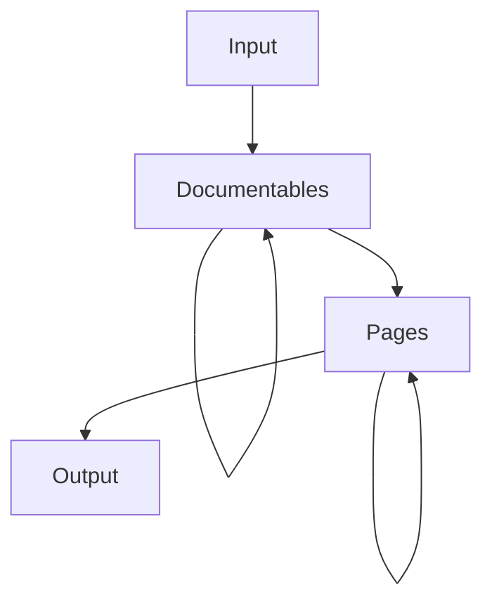

# Architecture overview

Normally, you would think that a tool like Dokka simply parses some programming language sources and generates
`HTML` pages for whatever it sees along the way, with little to no abstractions. That would be the simplest and
shortest way to implement a documentation engine.

However, it was clear that Dokka may need to generate documentation from various sources (not only `Kotlin`), that users
might request additional output formats (like `Markdown`), that users might need additional features like supporting
custom KDoc tags or rendering `mermaid.js` diagrams - all these things would require changing a lot of code inside
Dokka itself if all solutions were hardcoded.

For this reason, Dokka was built from the ground up to be extensible and customizable. You can think of the general
flow of generating documentation with Dokka as mapping one intermediate representation / abstraction into another.
You, as a Dokka developer or a plugin writer, can use extension points and introduce selective changes to the
model on any level without touching everything else.

## Overview of data model



* `Input` - generalization of sources, by default `Kotlin`/`Java` sources, but could be virtually anything
* `Documentables` - unified data model that represents any parsed sources as a tree. 
  Examples: class/function/package/property
* `Pages` - universal model that represents pages (e.g a function/property page) and its content
  (lists, text, code blocks) that the users needs to see
* `Output` - specific output format like `HTML`/`Markdown`/`Javadoc`/etc. This is a mapping of content to
  some human-readable and visual representation. For instance:
    * `ContentList` is mapped as
        * `<li>` / `<ul>` for `HTML` format
        * `1.` / `*` for `Markdown` format
    * `ContentCodeBlock` is mapped as
        * `<code>` or `<pre>` with some CSS styles in `HTML` format
        * Text wrapped in triple backticks for `Markdown` format


For a deeper dive into Dokka's data model with more examples and details,
see sections about [Documentables](data_model/documentables.md) and [Page/Content](data_model/page_content.md)

## Overview of extension points

An extension point usually represents some pluggable interface that performs an action during one of the stages of
generating documentation. An extension is therefore an implementation of that interface which is extending the
extension point.

You can create extension points, provide your own implementations (extensions) and configure them. All of
this is possible with Dokka's plugin/extension point API.

For a deeper dive into extensions and extension points with more examples and details, see
[Introduction to Extensions](extension_points/introduction.md).

Here's a sneak peek of the DSL:

```kotlin
class MyPlugin : DokkaPlugin() {
    // create an extension point for other developers
    val signatureProvider by extensionPoint<SignatureProvider>()

    // provide a default implementation
    val defaultSignatureProvider by extending {
        signatureProvider with KotlinSignatureProvider()
    }

    // register our own extension in someone else's plugin and override its default
    val dokkaBasePlugin by lazy { plugin<DokkaBase>() }
    val customOutputWriter by extending {
        (dokkaBasePlugin.outputWriter with MyOutputWriter()
                override dokkaBasePlugin.fileWriter)
    }
}

// use a registered extention, pretty much dependency injection
class MyExtension(val context: DokkaContext) {
    val signatureProvider: SignatureProvider = context.plugin<MyPlugin>().querySingle { signatureProvider }

    fun doSomething() {
        signatureProvider.signature(..)
    }
}

interface SignatureProvider {
    fun signature(documentable: Documentable): List<ContentNode>
}

class KotlinSignatureProvider : SignatureProvider {
    override fun signature(documentable: Documentable): List<ContentNode> = listOf()
}
```
