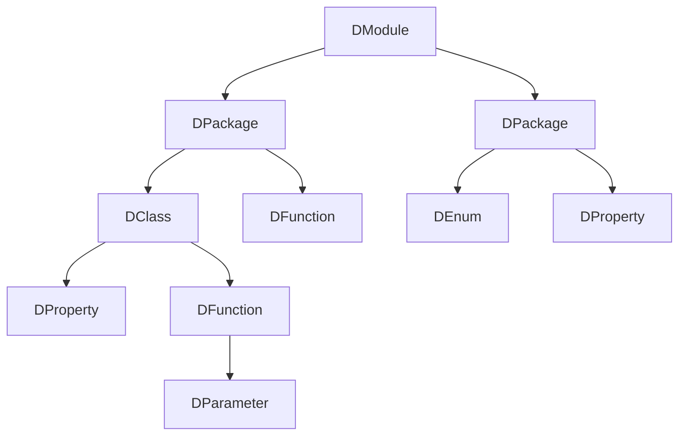

# Documentables Model

Documentables represent data that is parsed from sources. Think of this data model as of something that could be
seen or produced by a compiler frontend, it's not far off from the truth.

By default, documentables are parsed from `Descriptor` (for `Kotlin`)
and [Psi](https://plugins.jetbrains.com/docs/intellij/psi.html)
(for `Java`) models. Code-wise, you can have a look at following classes:

* `DefaultDescriptorToDocumentableTranslator` - responsible for `Kotlin` -> `Documentable` mapping
* `DefaultPsiToDocumentableTranslator` - responsible for `Java` -> `Documentable` mapping

Upon creation, it's a collection of trees, each with `DModule` as root.

Take some arbitrary `Kotlin` source code that is located within the same module:

```kotlin
// Package 1
class Clazz(val property: String) {
    fun function(parameter: String) {}
}

fun topLevelFunction() {}

// Package 2
enum class Enum { }

val topLevelProperty: String
```

This would be represented roughly as the following `Documentable` tree:



At later stages of transformation, all trees are folded into one (by `DocumentableMerger`).

## Documentable

The main building block of documentables model is `Documentable` class. It's the base class for all more specific types
that represent elements of parsed sources with mostly self-explanatory names (`DFunction`, `DPackage`, `DProperty`, etc)
.
`DClasslike` is the base class for class-like documentables such as `DClass`, `DEnum`, `DAnnotation`, etc.

The contents of each documentable normally represent what you would see in source code. For instance, if you open
`DClass`, you should find that it contains references to functions, properties, companion object, constructors and so
on.
`DEnum` should have references to enum entries, and `DPackage` can have references to both classlikes and top-level
functions and properties (`Kotlin`-specific).

Here's an example of a documentable:

```kotlin
data class DClass(
    val dri: DRI,
    val name: String,
    val constructors: List<DFunction>,
    val functions: List<DFunction>,
    val properties: List<DProperty>,
    val classlikes: List<DClasslike>,
    val sources: SourceSetDependent<DocumentableSource>,
    val visibility: SourceSetDependent<Visibility>,
    val companion: DObject?,
    val generics: List<DTypeParameter>,
    val supertypes: SourceSetDependent<List<TypeConstructorWithKind>>,
    val documentation: SourceSetDependent<DocumentationNode>,
    val expectPresentInSet: DokkaSourceSet?,
    val modifier: SourceSetDependent<Modifier>,
    val sourceSets: Set<DokkaSourceSet>,
    val isExpectActual: Boolean,
    val extra: PropertyContainer<DClass> = PropertyContainer.empty()
) : DClasslike(), WithAbstraction, WithCompanion, WithConstructors,
    WithGenerics, WithSupertypes, WithExtraProperties<DClass>
```

___

There are three non-documentable classes that important for this model:

* `DRI`
* `SourceSetDependent`
* `ExtraProperty`.

### DRI

`DRI` stans for _Dokka Resource Identifier_ - a unique value that identifies a specific `Documentable`.
All references and relations between documentables (other than direct ownership) are described using `DRI`.

For example, `DFunction` with a parameter of type `Foo` has only `Foo`'s `DRI`, not the actual reference
to `Foo`'s `Documentable` object.

#### Example

For an example of how a `DRI` can look like, let's take the `limitedParallelism` function from `kotlinx.coroutines`:

```kotlin
package kotlinx.coroutines

import ...
        
public abstract class MainCoroutineDispatcher : CoroutineDispatcher() {
    
    override fun limitedParallelism(parallelism: Int): CoroutineDispatcher {
        ...
    }
}
```

If we were to re-create the DRI of this function in code, it would look something like this:

```kotlin
DRI(
    packageName = "kotlinx.coroutines",
    classNames = "MainCoroutineDispatcher",
    callable = Callable(
        name = "limitedParallelism",
        receiver = null,
        params = listOf(
            TypeConstructor(
                fullyQualifiedName = "kotlin.Int",
                params = emptyList()
            )
        )
    ),
    target = PointingToDeclaration,
    extra = null
)
```

If you format it as `String`, it would look like this:

```
kotlinx.coroutines/MainCoroutineDispatcher/limitedParallelism/#kotlin.Int/PointingToDeclaration/
```

### SourceSetDependent

`SourceSetDependent` helps handling multiplatform data by associating platform-specific data (declared with either
`expect` or `actual` modifier) with particular 
[source sets](https://kotlinlang.org/docs/multiplatform-discover-project.html#source-sets).

This comes in handy if `expect`/`actual` declarations differ. For instance, the default value for `actual` might differ
from that declared in `expect`, or code comments written for `expect` might be different from what's written
for `actual`.

Under the hood, it's a `typealias` to a `Map`:

```kotlin
typealias SourceSetDependent<T> = Map<DokkaSourceSet, T>
```

### ExtraProperty

`ExtraProperty` is used to store any additional information that falls outside of the regular model. It is highly
recommended to use extras to provide any additional information when creating custom Dokka plugins.

This element is a bit more complex, so you can read more about how to use it
[in a separate section](extra.md).

___

## Documentation model

Documentation model is used alongside Documentables to store data obtained by parsing
code comments (such as `KDoc`/`Javadoc`).

### DocTag

`DocTag` describes a specific documentation syntax element.

It's universal across source languages. For instance, DocTag `B` is the same for `**bold**` in `Kotlin` and
`<b>bold</b>` in `Java`.

However, some `DocTag` elements are specific to a certain language, there are many such examples for `Java`
because it allows HTML tags inside `Javadoc` comments, some of which are simply not possible to reproduce with `Markdown`.

`DocTag` elements can be deeply nested with other `DocTag` children elements.

Examples:

```kotlin
data class H1(
    override val children: List<DocTag> = emptyList(),
    override val params: Map<String, String> = emptyMap()
) : DocTag()

data class H2(
    override val children: List<DocTag> = emptyList(),
    override val params: Map<String, String> = emptyMap()
) : DocTag()

data class Strikethrough(
    override val children: List<DocTag> = emptyList(),
    override val params: Map<String, String> = emptyMap()
) : DocTag()

data class Strong(
    override val children: List<DocTag> = emptyList(),
    override val params: Map<String, String> = emptyMap()
) : DocTag()

data class CodeBlock(
    override val children: List<DocTag> = emptyList(),
    override val params: Map<String, String> = emptyMap()
) : Code()

```

### TagWrapper

`TagWrapper` describes the whole comment description or a specific comment tag.
For example: `@see` / `@author` / `@return`.

Since each such section may contain formatted text inside of it, each `TagWrapper` has `DocTag` children.

```kotlin
/**
 * @author **Ben Affleck*
 * @return nothing, except _sometimes_ it may throw an [Error]
 */
fun foo() {}
```

### DocumentationNode

`DocumentationNode` acts as a container for multiple `TagWrapper` elements for a specific `Documentable`, usually
used like this:

```kotlin
data class DFunction(
    ...
    val documentation: SourceSetDependent<DocumentationNode>,
    ...
)
```
