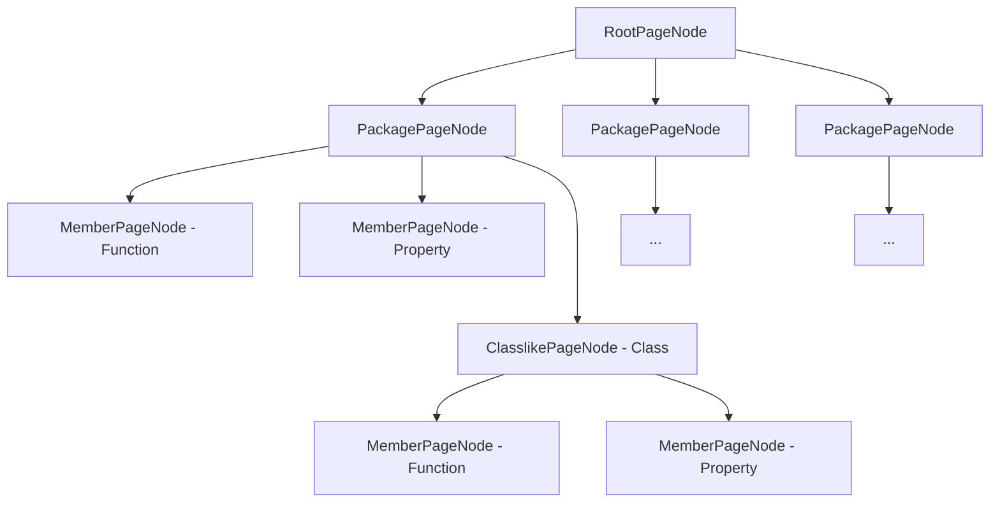

# Page / Content Model

Even though `Page` and `Content` models reside on the same level (under `Page`), it's easier to view it as two different
models altogether, even though `Content` is only used in conjunction with and inside `Page` model.

## Page

Page model represents the structure of documentation pages to be generated. During rendering, each page
is processed separately, so one page corresponds to exactly one output file.

Page model is independent of the final output format, in other words it's universal. Which extension the pages
should be created as (`.html`, `.md`, etc) and how is up to the `Renderer`.

Subclasses of `PageNode` represent different kinds of rendered pages, such as `ModulePage`, `PackagePage`,
`ClasslikePage`, `MemberPage` (properties, functions), etc.

The Page Model is a tree structure, with `RootPageNode` at the root.

Here's an example of how an arbitrary `Page` tree might look like for a module with 3 packages, one of which contains
a top level function, top level property and a class, inside which there's a function and a property:



Almost all pages are derivatives of `ContentPage` - it's the type of `Page` that has `Content` on it.

## Content Model

Content model describes how the actual `Page` content is presented. The important thing to understand is that it's
also output-format independent and is universal.

Content model is essentially a set of building blocks that you can put together to represent some content.
Have a look at subclasses of `ContentNode`: `ContentText`, `ContentList`, `ContentTable`, `ContentCodeBlock`, 
`ContentHeader` and so on. You can group content together with `ContentGroup` - for instance,
to wrap all children with some style.

```kotlin
// real example of composing content using `DocumentableContentBuilder` DSL
orderedList {
    item {
        text("This list contains a nested table:")
        table {
            header {
                text("Col1")
                text("Col2")
            }
            row {
                text("Text1")
                text("Text2")
            }
        }
    }
    item {
        group(styles = setOf(TextStyle.Bold)) {
            text("This is bald")
            text("This is also bald")
        }
    }
}
```

It is then responsibility of `Renderer` (i.e specific output format) to render it the way it wants. 

For instance, `HtmlRenderer` might render `ContentCodeBlock` as `<code>text</code>`, but `CommonmarkRenderer` might 
render it using backticks.

___

### DCI

Each node is identified by unique `DCI`, which stands for _Dokka Content Identifier_. `DCI` aggregates `DRI`s of all
`Documentables` that make up a specific `ContentNode`.

```kotlin
data class DCI(val dri: Set<DRI>, val kind: Kind)
```

All references to other nodes (other than direct ownership) are described using `DCI`.

### ContentKind

`ContentKind` represents a grouping of content of one kind that can can be rendered as part of a composite
page (one tab/block within a class's page, for instance).

For instance, on the same page that describes a class you can have multiple sections (== `ContentKind`).
One to describe functions, one to describe properties, another one to describe constructors and so on.

### Styles

Each `ContentNode` has `styles` property in case you want to incidate to `Renderer` that this content needs to be
displayed in a certain way.

```kotlin
group(styles = setOf(TextStyle.Paragraph)) {
    text("Text1", styles = setOf(TextStyle.Bold))
    text("Text2", styles = setOf(TextStyle.Italic))
}
```

It is then responsibility of `Renderer` (i.e specific output format) to render it the way it wants. For instance,
`HtmlRenderer` might render `TextStyle.Bold` as `<b>text</b>`, but `CommonmarkRenderer` might render it as `**text**`.

There's a number of existing styles that you can use, most of them are supported by `HtmlRenderer` out of the box:

```kotlin
// for code highlighting
enum class TokenStyle : Style {
    Keyword, Punctuation, Function, Operator, Annotation,
    Number, String, Boolean, Constant, Builtin, ...
}

enum class TextStyle : Style {
    Bold, Italic, Strong, Strikethrough, Paragraph, ...
}

enum class ContentStyle : Style {
    TabbedContent, RunnableSample, Wrapped, Indented, ...
}
```

### Extra

`ExtraProperty` is used to store any additional information that falls outside of the regular model. It is highly
recommended to use extras to provide any additional information when creating custom Dokka plugins.

All `ExtraProperty` elements from `Documentable` model are propagated into `Content` model and are available
for `Renderer`.

This element is a bit complex, so you can read more about how to use it [in a separate section](extra.md).
