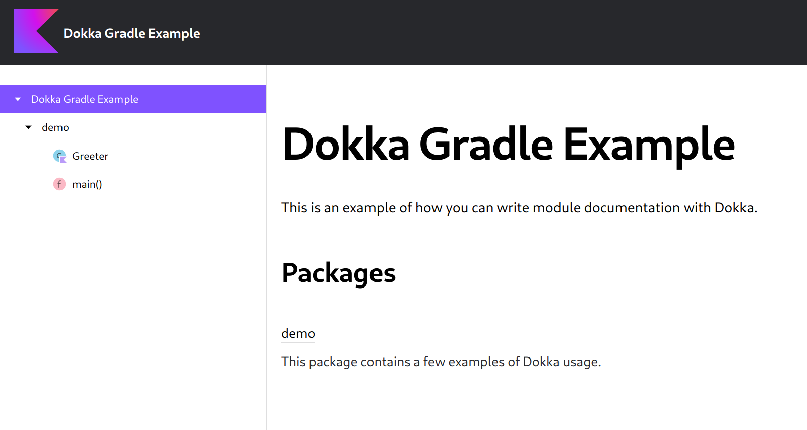

# Dokka Gradle example

This example demonstrates how to apply Dokka in a simple single-project Gradle build, as well as how to configure it.

Configuration changes:

* Custom project name used in the header, `Dokka Gradle Example`.
* Description for the project and the packages taken from [Module.md](Module.md).
* Documentation contains source links that lead to declarations in this GitHub repository.



### Running

Run the `:dokkaGenerate` Gradle task to generate documentation for this example:

```bash
./gradlew :dokkaGenerate
```
