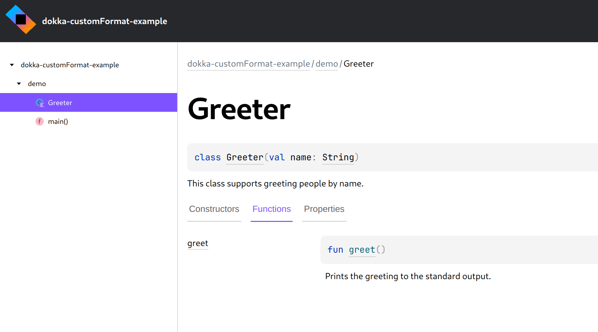

## Dokka custom format example

This example demonstrates how to override `.css` styles and add custom images as assets, allowing
you to change the logo used in the header.

You can see up-to-date documentation generated for this example on
[GitHub Pages](https://kotlin.github.io/dokka/examples/dokka-customFormat-example/html/index.html).



### Running

Run the `:dokkaGenerate` Gradle task to generate documentation with the custom logo:

```bash
./gradlew :dokkaGenerate
```
