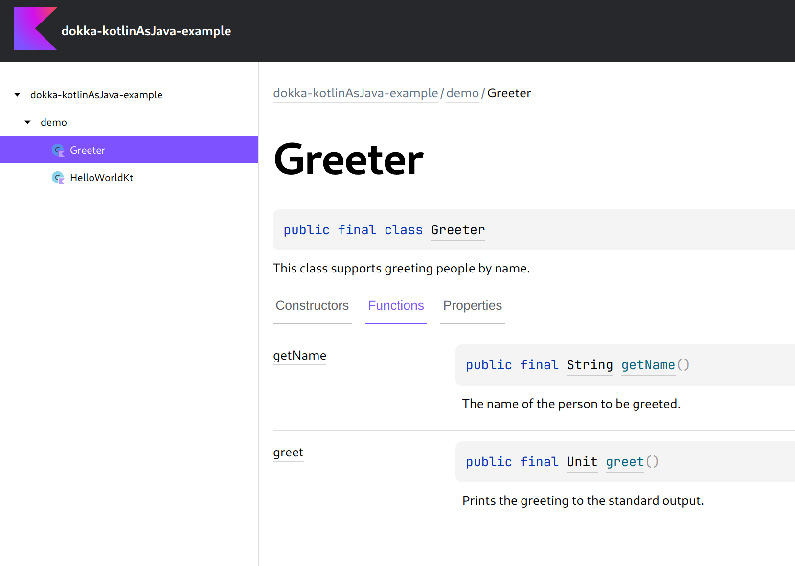

# Dokka Kotlin-as-Java plugin example

This example demonstrates how you can apply a Dokka plugin in a simple Gradle project.

In particular, it applies [Kotlin as Java](../../../plugins/kotlin-as-java) Dokka plugin that renders all
Kotlin signatures as Java signatures.



### Running

Run `:dokkaGenerate` task to generate documentation for this example:

```bash
./gradlew :dokkaGenerate
```
