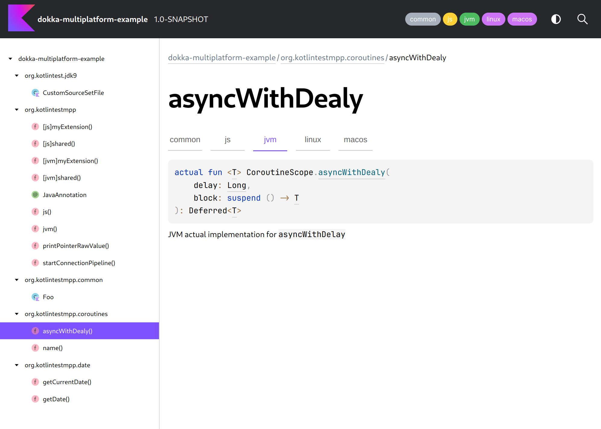

# Dokka Multiplatform example

This example demonstrates Dokka's configuration and output for a simple
[Kotlin Multiplatform](https://kotlinlang.org/docs/multiplatform.html) project.

It contains [Kotlin source sets](https://kotlinlang.org/docs/multiplatform-discover-project.html#source-sets) for
different
platforms that are automatically picked up by Dokka from the Kotlin Gradle Plugin, and an additional custom source
set known to Dokka only.

The example demonstrates the following things:

* Documentation for common code
* Documentation for expect/actual declarations available via tabs
* Documentation for platform-specific declarations, including functions from different source sets, but
  with clashing names
* Use of Platform-specific API, such as `CPointer` from `kotlinx.cinterop`



### Running

Run the `:dokkaGenerate` Gradle task to generate documentation for this example:

```bash
./gradlew :dokkaGenerate
```
