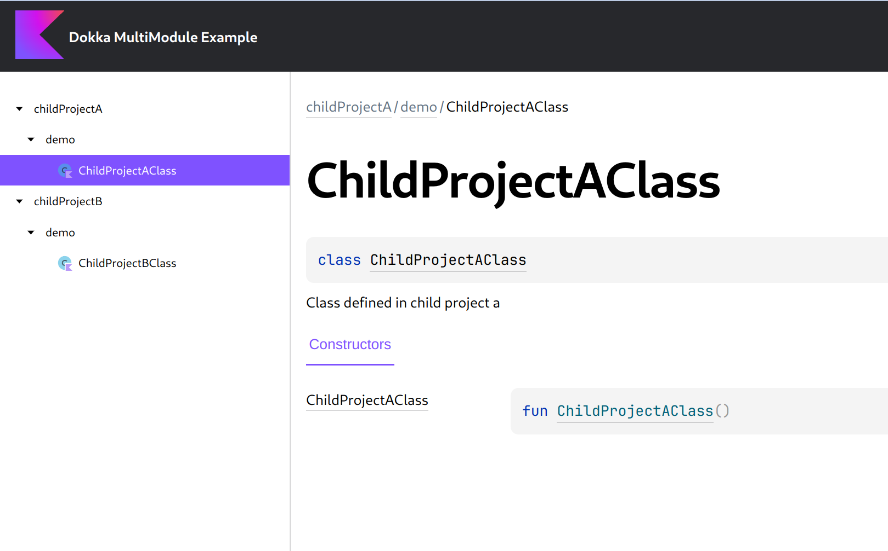

# Dokka MultiModule example

This example demonstrates how to apply and configure Dokka in a
[multi-project build](https://docs.gradle.org/current/userguide/multi_project_builds.html).

____



### Running

Run the `:docs:dokkaGenerate` Gradle task to generate documentation for this example:

```bash
./gradlew :docs:dokkaGenerate
```

It will generate complete documentation for the root project and its subprojects, with a common
Table of Contents.
