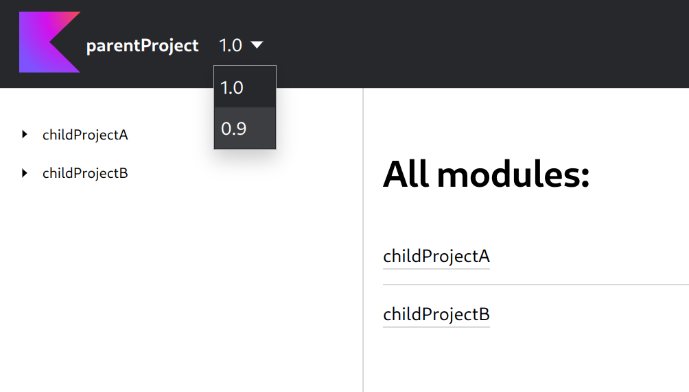

# Dokka Versioning MultiModule example

This example demonstrates configuration of Dokka's [versioning plugin](../../../dokka-subprojects/plugin-versioning),
which
allows readers to navigate through different versions of your API reference documentation.

The example contains some code that exists only in the current documentation version `1.0`. You will not see
this code in the previous version `0.9`, which is located in the [previousDocVersions](previousDocVersions) directory.



### Running

Run the `:docs:dokkaGenerate` Gradle task to generate documentation for this example:

```bash
./gradlew :docs:dokkaGenerate
```

It will generate complete documentation for the root project and its subprojects, with the version navigation
dropdown menu.
