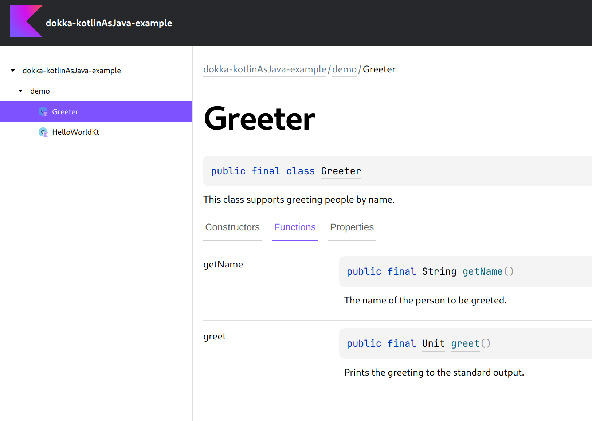

# Dokka Kotlin-as-Java plugin example

This example demonstrates how you can apply a Dokka plugin in a simple Gradle project.

In particular, it applies [Kotlin as Java](../../../plugins/kotlin-as-java) Dokka plugin that renders all
Kotlin signatures as Java signatures.

You can see up-to-date documentation generated for this example on
[GitHub Pages](https://kotlin.github.io/dokka/examples/dokka-kotlinAsJava-example/html/index.html).



### Running

Run `dokkaHtml` task in order to generate documentation for this example:

```bash
./gradlew dokkaHtml
```
