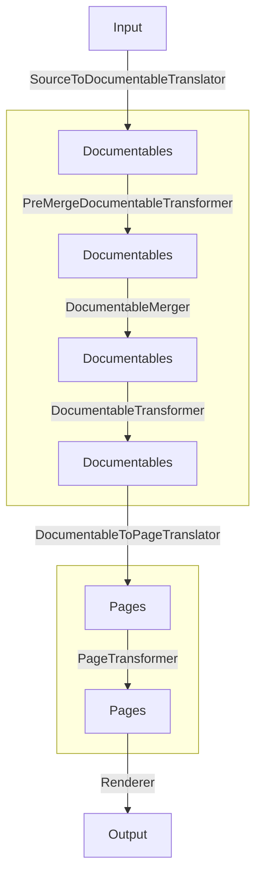

# Core extension points

Core extension points represent the main stages of generating documentation. 

These extension points are plugin and output format independent, meaning it's the very core functionality and as
low-level as can get. For higher-level extension functions that can be used in different output formats, have a look at
[Base extensions](base_extensions.md) defined in `DokkaBase`.

You can find all core extensions in `CoreExtensions` class:
```kotlin
object CoreExtensions {
    val preGenerationCheck by coreExtensionPoint<PreGenerationChecker>()
    val generation by coreExtensionPoint<Generation>()
    val sourceToDocumentableTranslator by coreExtensionPoint<SourceToDocumentableTranslator>()
    val documentableMerger by coreExtensionPoint<DocumentableMerger>()
    val documentableTransformer by coreExtensionPoint<DocumentableTransformer>()
    val documentableToPageTranslator by coreExtensionPoint<DocumentableToPageTranslator>()
    val pageTransformer by coreExtensionPoint<PageTransformer>()
    val renderer by coreExtensionPoint<Renderer>()
    val postActions by coreExtensionPoint<PostAction>()
}
```

On this page we'll go over each extension point individually.

## PreGenerationChecker

`PreGenerationChecker` can be used to run some checks and constraints. 

For instance, `Javadoc` plugin does not support generating documentation for multi-platform projects, so it uses
`PreGenerationChecker` to check for multi-platform
[source sets](https://kotlinlang.org/docs/multiplatform-discover-project.html#source-sets) and fails if it finds any.

## Generation

`Generation` is responsible for generating documentation as a whole, utilizing other extension points where applicable.

There are two implementations at the moment:

* `AllModulesPageGeneration` - generates multimodule documentation, for instance when `dokkaHtmlMultiModule` task is
  invoked.
* `SingleModuleGeneration` - generates documentation for a single module, for instance when `dokkaHtml` task is invoked

### AllModulesPageGeneration

`AllModulesPageGeneration` utilizes output generated by `SingleModuleGeneration`. Under the hood it just collects all
pages generated for individual modules and assembles everything together, creating navigation pages between the
modules and so on.

### SingleModuleGeneration stages

When developing a feature or a plugin, it's more convenient to think that you are generating documentation for single
module projects, believing that Dokka will somehow take care of the rest in multimodule environment.

`SingleModuleGeneration` is at heart of generating documentation and utilizes other core extension points, so
it's worth going over its stages. 

Below you can see the transformations of [Dokka's models](../architecture_overview.md#overview-of-data-model) and 
extension interfaces responsible for each one. Notice how `Documentables` and `Pages` are transformed multiple times.



#### SourceToDocumentableTranslator

`SourceToDocumentableTranslator` translates sources into documentable model. 

`Kotlin` and `Java` sources are supported by default, but you can analyze any language as long as you can map
it to the [Documentable](../data_model/documentables.md) model.

For reference, see

* `DefaultDescriptorToDocumentableTranslator` for `Kotlin` sources translation
* `DefaultPsiToDocumentableTranslator` for `Java` sources translation

#### PreMergeDocumentableTransformer

This extension point actually comes from `DokkaBase` and is not a core extension point, but it's used in
`SingleModuleGeneration` nonetheless. If you are implementing your own plugin without relying on `DokkaBase`,
you can either introduce a similar extension point or rely on [DocumentableTransformer](#documentabletransformer) which
will be discussed below.

`PreMergeDocumentableTransformer` allows applying any transformation to 
[Documentables model](../data_model/documentables.md) before different 
[source sets](https://kotlinlang.org/docs/multiplatform-discover-project.html#source-sets) are merged. 

Useful if you want to filter/map existing documentables. For instance, if you want to exclude members annotated with
`@Internal`, you most likely need an implementation of `PreMergeDocumentableTransformer`.

For simple condition-based filtering of documentables consider extending 
`SuppressedByConditionDocumentableFilterTransformer` - it implements `PreMergeDocumentableTransformer` and only
requires one function to be overridden. The rest is taken care of.

#### DocumentableMerger

`DocumentableMerger` merges all `DModule` instances into one. Only one extension is expected of this type.

#### DocumentableTransformer

`DocumentableTransformer` performs the same function as `PreMergeDocumentableTransformer`, but after merging source
sets.

Notable example is `InheritorsExtractorTransformer`, it extracts inherited classes data across 
[source sets](https://kotlinlang.org/docs/multiplatform-discover-project.html#source-sets) and creates an inheritance
map.

#### DocumentableToPageTranslator

`DocumentableToPageTranslator` is responsible for creating pages and their content. See 
[Page/Content model](../data_model/page_content.md) section for more information and examples.

Different output formats can either use the same page structure or define their own in case it needs to be different.

Only a single extension of this type is expected to be registered. 

#### PageTransformer

`PageTransformer` is useful if you need to add/remove/modify generated pages or their content.

Plugins like `mathjax` can add `.js` scripts to pages using this extension point. 

If you want all overloaded functions to be rendered on the same page (instead of separate ones),
you can also use `PageTransformer` to delete excessive pages and combine them into a new single one.

#### Renderer

`Renderer` - defines rules on what to do with pages and their content, which files to create and how to display
it properly. 

Output format implementations should use `Renderer` extension point. Notable examples are `HtmlRenderer`
and `CommonmarkRenderer`.

## PostAction

`PostAction` is useful for when you want to run some actions after the documentation has been generated - for instance
if you want to move some files around.

[Versioning plugin](https://github.com/Kotlin/dokka/tree/master/plugins/versioning) utilizes `PostAction` in order to move
generated documentation to versioned folders.
