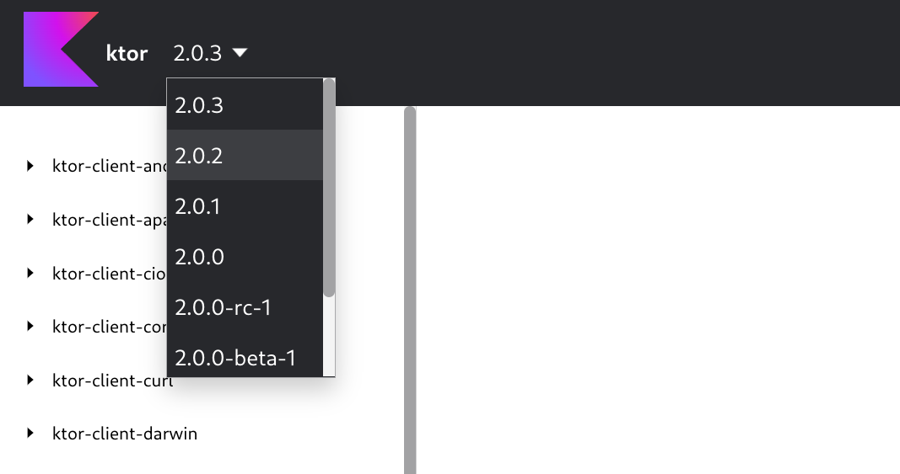

# Versioning plugin

The versioning plugin provides the ability to host documentation for multiple versions of your library/application
with seamless switching between them. This, in turn, provides a better experience for your users.



**Note:** The versioning plugin only works with Dokka's HTML format.

Visit the [versioning plugin example project](../../examples/gradle/dokka-versioning-multimodule-example)
to see an example of it in action and how it can be configured.

## Applying the plugin

You can apply the versioning plugin the same way as other Dokka plugins:

<details open>
<summary>Kotlin</summary>

```kotlin
dependencies {
    dokkaHtmlPlugin("org.jetbrains.dokka:versioning-plugin:1.7.20")
}
```

**Note:** When documenting multi-project builds, you need to apply the versioning 
plugin within subprojects as well as in their parent project.

</details>

<details>
<summary>Groovy</summary>

```groovy
dependencies {
    dokkaHtmlPlugin 'org.jetbrains.dokka:versioning-plugin:1.7.20'
}
```

**Note:** When documenting multi-project builds, you need to apply the versioning 
plugin within subprojects as well as in their parent project.

</details>

<details>
<summary>Maven</summary>

```xml
<plugin>
    <groupId>org.jetbrains.dokka</groupId>
    <artifactId>dokka-maven-plugin</artifactId>
    ...
    <configuration>
        <dokkaPlugins>
            <plugin>
                <groupId>org.jetbrains.dokka</groupId>
                <artifactId>versioning-plugin</artifactId>
                <version>1.7.20</version>
            </plugin>
        </dokkaPlugins>
    </configuration>
</plugin>
```

</details>

<details>
<summary>CLI</summary>

You can find the versioning plugin's artifact on
[mvnrepository](https://mvnrepository.com/artifact/org.jetbrains.dokka/versioning-plugin/1.7.20) or by browsing
[maven central repository](https://repo1.maven.org/maven2/org/jetbrains/dokka/versioning-plugin/1.7.20)
directly, and pass it to `pluginsClasspath`.

Via command line arguments:

```Bash
java -jar dokka-cli-1.7.20.jar \
     -pluginsClasspath "./dokka-base-1.7.20.jar;...;./versioning-plugin-1.7.20.jar" \
     ...
```

Via JSON configuration:

```json
{
  ...
  "pluginsClasspath": [
    "./dokka-base-1.7.20.jar",
    "...",
    "./versioning-plugin-1.7.20.jar"
  ],
  ...
}
```

</details>

## Configuration

### Configuration options

The table below contains all the possible configuration options for the versioning plugin and their purpose.

| **Option**                           | **Description**                                                                                                                                                                                        |
|--------------------------------------|--------------------------------------------------------------------------------------------------------------------------------------------------------------------------------------------------------|
| `version`                            | The version of your application/library that documentation is going to be generated for. This will be the version shown in the dropdown menu.                                                          |
| `versionsOrdering`                   | An optional list of strings that represents the order that versions should appear in the dropdown menu. Must match `version` string exactly. The first item in the list is at the top of the dropdown. |
| `olderVersionsDir`                   | An optional path to a parent folder that contains other documentation versions. It requires a specific directory structure. For more information, see [Directory structure](#directory-structure).     |
| `olderVersions`                      | An optional list of paths to other documentation versions. It must point to Dokka's outputs directly. This is useful if different versions can't all be in the same directory.                         |
| `renderVersionsNavigationOnAllPages` | An optional boolean value indicating whether to render the navigation dropdown on all pages. Set to true by default.                                                                                   |

#### Directory structure

Note that the directory passed to `olderVersionsDir` needs to follow a specific structure:

```text
.
└── olderVersionsDir
    └── 1.7.10
        ├── <dokka output>
    └── 1.7.20
        ├── <dokka output>
...
```

### Configuration example

<details open>
<summary>Kotlin</summary>

```kotlin
import org.jetbrains.dokka.versioning.VersioningPlugin
import org.jetbrains.dokka.versioning.VersioningConfiguration

buildscript {
    dependencies {
        classpath("org.jetbrains.dokka:versioning-plugin:1.7.20")
    }
}

tasks.dokkaHtml {
    pluginConfiguration<VersioningPlugin, VersioningConfiguration> {
        version = "1.5"
        versionsOrdering = listOf("1.5", "1.4", "1.3", "1.2", "1.1", "alpha-2", "alpha-1")
        olderVersionsDir = file("documentation/version")
        olderVersions = listOf(file("documentation/alpha/alpha-2"), file("documentation/alpha/alpha-1"))
        renderVersionsNavigationOnAllPages = true
    }
}
```

Alternatively, you can configure it via JSON:

```kotlin
    val versioningConfiguration = """
    {
      "version": "1.5",
      "versionsOrdering": ["1.5", "1.4", "1.3", "1.2", "1.1", "alpha-2", "alpha-1"],
      "olderVersionsDir": "documentation/version",
      "olderVersions": ["documentation/alpha/alpha-2", "documentation/alpha/alpha-1"],
      "renderVersionsNavigationOnAllPages": true
    }
    """
    pluginsMapConfiguration.set(
        mapOf(
            "org.jetbrains.dokka.versioning.VersioningPlugin" to versioningConfiguration
        )
    )
```

</details>

<details>
<summary>Groovy</summary>

```groovy
dokkaHtml {
    String versioningConfiguration = """
    {
      "version": "1.5",
      "versionsOrdering": ["1.5", "1.4", "1.3", "1.2", "1.1", "alpha-2", "alpha-1"],
      "olderVersionsDir": "documentation/version",
      "olderVersions": ["documentation/alpha/alpha-2", "documentation/alpha/alpha-1"],
      "renderVersionsNavigationOnAllPages": true
    }
    """
    pluginsMapConfiguration.set(
            ["org.jetbrains.dokka.versioning.VersioningPlugin": versioningConfiguration]
    )
}
```

</details>

<details>
<summary>Maven</summary>

```xml
<plugin>
    <groupId>org.jetbrains.dokka</groupId>
    <artifactId>dokka-maven-plugin</artifactId>
    ...
    <configuration>
        <pluginsConfiguration>
            <org.jetbrains.dokka.versioning.VersioningPlugin>
                <version>1.5</version>
                <versionsOrdering>
                    <version>1.5</version>
                    <version>1.4</version>
                    <version>1.3</version>
                    <version>1.2</version>
                    <version>1.1</version>
                    <version>alpha-2</version>
                    <version>alpha-1</version>
                </versionsOrdering>
                <olderVersionsDir>${project.basedir}/documentation/version</olderVersionsDir>
                <olderVersions>
                    <version>${project.basedir}/documentation/alpha/alpha-2</version>
                    <version>${project.basedir}/documentation/alpha/alpha-1</version>
                </olderVersions>
                <renderVersionsNavigationOnAllPages>true</renderVersionsNavigationOnAllPages>
            </org.jetbrains.dokka.versioning.VersioningPlugin>
        </pluginsConfiguration>
    </configuration>
</plugin>
```

</details>

<details>
<summary>CLI</summary>

```Bash
java -jar dokka-cli-1.7.20.jar \
     ...
     -pluginsConfiguration "org.jetbrains.dokka.versioning.VersioningPlugin={\"version\": \"1.5\", \"versionsOrdering\": [\"1.5\", \"1.4\", \"1.3\", \"1.2\", \"1.1\", \"alpha-2\", \"alpha-1\"], \"olderVersionsDir\": \"documentation/version\", \"olderVersions\": [\"documentation/alpha/alpha-2\", \"documentation/alpha/alpha-1\"], \"renderVersionsNavigationOnAllPages\": true}"

```

Alternatively, via JSON configuration:
```json
{
  "moduleName": "Dokka Example",
  ...
  "pluginsConfiguration": [
    {
      "fqPluginName": "org.jetbrains.dokka.versioning.VersioningPlugin",
      "serializationFormat": "JSON",
      "values": "{\"version\": \"1.5\", \"versionsOrdering\": [\"1.5\", \"1.4\", \"1.3\", \"1.2\", \"1.1\", \"alpha-2\", \"alpha-1\"], \"olderVersionsDir\": \"documentation/version\", \"olderVersions\": [\"documentation/alpha/alpha-2\", \"documentation/alpha/alpha-1\"], \"renderVersionsNavigationOnAllPages\": true}"
    }
  ]
}
```

</details>

## Generating versioned documentation

With the versioning plugin applied and configured, no other steps are needed. Documentation can be built in the usual way.

Among other things, the versioning plugin adds a `version.json` file to the output folder. This file is used by the
plugin to match versions and generate version navigation. If your previously generated documentation does not have that
file, you will need to re-generate documentation for such versions. Just adding the file will not work.

The versioning plugin also bundles all other documentation versions that have been passed through `olderVersionsDir`
and `olderVersions` configuration options by putting them inside the `older` directory.

## Usage example

There is no single correct way to configure the plugin, it can be tailored to your needs. However,
it can be a bit overwhelming when starting out. Below you will find one of the ways it can be configured so that you
can begin publishing versioned documentation straight away.

The main idea behind it is the following:

1. One directory contains all versions of your documentation. For example, `documentation/version/{doc_version}`.
   This is your archive which is needed for future builds.
2. The output directory of all new builds is set to that directory as well, under `documentation/version/{new_version}`.
3. When new builds are executed, the plugin looks for previous versions of documentation in the archive directory.
4. Once new documentation has been generated, it needs to be **copied** to somewhere accessible by the user.
   For example, GitHub pages or nginx static directories. It needs to be **copied**, not moved because Dokka will still
   need this version for future builds, otherwise there will be a gap in the archive.
5. Once it has been safely copied, you can remove the `older` directory from the newly generated and archived version.
   This helps reduce the overhead of each version bundling all previous versions, as these files are effectively duplicates.

```kotlin
import org.jetbrains.dokka.versioning.VersioningPlugin
import org.jetbrains.dokka.versioning.VersioningConfiguration

buildscript {
    dependencies {
        classpath("org.jetbrains.dokka:versioning-plugin:1.7.20")
    }
}

dependencies {
    dokkaPlugin("org.jetbrains.dokka:versioning-plugin:$dokkaVersion")
}

tasks.dokkaHtml {
    // This can be any persistent folder where
    // you store documentation by version
    val docVersionsDir = projectDir.resolve("documentation/version")

    // The version for which you are currently generating docs
    val currentVersion = "1.3"
    
    // Set the output to a folder with all other versions
    // as you'll need the current version for future builds
    val currentDocsDir = docVersionsDir.resolve(currentVersion)
    outputDirectory.set(currentDocsDir)

    pluginConfiguration<VersioningPlugin, VersioningConfiguration> {
        olderVersionsDir = docVersionsDir
        version = currentVersion
    }

    doLast {
        // This folder contains the latest documentation with all
        // previous versions included, so it's ready to be published.
        // Make sure it's copied and not moved - you'll still need this
        // version for future builds
        currentDocsDir.copyTo(file("/my/hosting"))
       
        // Only once current documentation has been safely moved,
        // remove previous versions bundled in it. They will not
        // be needed in future builds, it's just overhead.
        currentDocsDir.resolve("older").deleteRecursively()
    }
}
```
